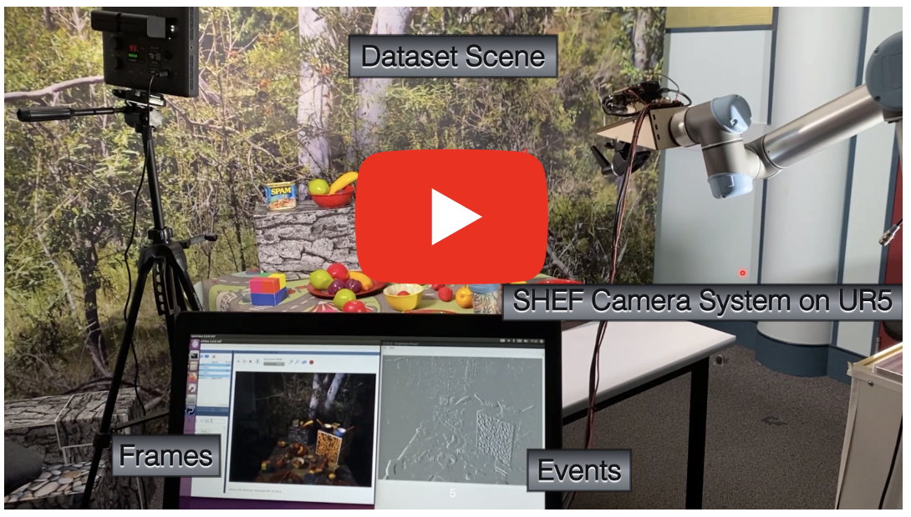

# Stereo Hybrid Event-Frame (SHEF) Cameras for 3D Perception

  

Ziwei Wang, Liyuan Pan, Yonhon Ng, Zheyu Zhuang and Robert Mahony

The paper was accepted by the 2021 IEEE/RSJ International Conference on Intelligent Robots and Systems (IROS 2021) in Prague, Czech Republic.

[[Paper](https://ieeexplore.ieee.org/abstract/document/9636312)]
[[ArXiv](https://arxiv.org/abs/2110.04988)]

## Citation 
If you use or discuss our SHEF algorithm, or use the dataset, please cite our paper as follows:
<pre>
@inproceedings{wang2021stereo,
  title={Stereo Hybrid Event-Frame (SHEF) Cameras for 3D Perception},
  author={Wang, Ziwei and Pan, Liyuan and Ng, Yonhon and Zhuang, Zheyu and Mahony, Robert},
  booktitle={2021 IEEE/RSJ International Conference on Intelligent Robots and Systems (IROS)},
  year={2021},
  organization={IEEE}
}
</pre>

## [Clikck Here to Download Data](https://anu365-my.sharepoint.com/:f:/g/personal/u6456661_anu_edu_au/EuotzBGRLk1AhfOe9LlZuSQBVtis9MH86vz1DQgt8hzQPA?e=jhRg1h) 

### ./event_frame_depth_data/stereo_event_frame_raw_data

Three scenarios: `picnic`, `complex boxes`, and `simple boxes`.
Each scenario includes at least 6 sequences with different camera speeds and lighting conditions.

|                      | From FLIR RGB camera | From Prophesee event camera | Description                                                                                             |
|----------------------|----------------------|-----------------------------|---------------------------------------------------------------------------------------------------------| 
| `intensity_images`  | yes                     | no                          |Synchronised intensity images from FLIR RGB camera |
| `images_ts.txt`     | no                      | yes                         |Timestamps of the ynchronised intensity images. We synchronise the two cameras by sending a trigger signal from the FLIR RGB camera to the event camera. |
| `log_td.dat`        | no                      | yes                         |Event data, includes event x, y, ts, p |                                             
#### processed depth ground truth examples
./event_frame_depth_data/depth_ground_truth

#### stereo hybrid event-frame calibration data
./calibration_data/stereo_event_frame

#### point cloud
./calibration_data/point_cloud

#### UR5 robot arm pose
./calibration_data/ur5_pose

### [Click here to find the parameters for each sequence](https://docs.google.com/spreadsheets/d/1so2S-R-0OyHtPx6rzRnHimwNJFnQP-UNSiHOV1cqRFM/edit?usp=sharing)

## Run Our Baseline Disparity Algorithm
Run [run_disparity.m](https://github.com/ziweiWWANG/SHEF/tree/master/baseline_disparity_code/run_disparity.m).
It will load event-frame pairs from [baseline_disparity_code/data/event_edge](https://github.com/ziweiWWANG/SHEF/tree/master/baseline_disparity_code/data/event_edge) and [baseline_disparity_code/data/frame_edge](https://github.com/ziweiWWANG/SHEF/tree/master/baseline_disparity_code/data/frame_edge).

## Evaluation
Enter folder [baseline_disparity_code/include](https://github.com/ziweiWWANG/SHEF/tree/master/baseline_disparity_code/include) and run [evaluation.m](https://github.com/ziweiWWANG/SHEF/tree/master/baseline_disparity_code/include/evaluation.m).
It will load estimated depth from [baseline_disparity_code/data/Dp](https://github.com/ziweiWWANG/SHEF/tree/master/baseline_disparity_code/data/Dp) and ground truth depth from [baseline_disparity_code/data/gt](https://github.com/ziweiWWANG/SHEF/tree/master/baseline_disparity_code/data/gt), and display the average `bad-p`, `RMSE` and `inlier ratio` performance.

## Notes: 
1. Events are decompressed from `.raw` to `.dat` format. To convert raw data to `.dat` or `.csv` format, we used the Prophesee tools in [Prophesee_tools](https://anu365-my.sharepoint.com/:f:/g/personal/u6456661_anu_edu_au/EuotzBGRLk1AhfOe9LlZuSQBVtis9MH86vz1DQgt8hzQPA?e=jhRg1h)
You can also install the last Prophesee software version follow the instructions on the [website](https://www.prophesee.ai/)
If you need, you can find all tools in `usr/share/prophesee_driver/samples/` or `usr/share/metavision/sdk/driver/samples/`, depending on what version you are using.

2. You can use the provided code to generate depth groud truth from camera position and point cloud. Or you can download the example depth ground truth images from [./event_frame_depth_data/depth_ground_truth](https://anu365-my.sharepoint.com/:f:/g/personal/u6456661_anu_edu_au/EuotzBGRLk1AhfOe9LlZuSQBVtis9MH86vz1DQgt8hzQPA?e=jhRg1h).

3. For academic use only. Should you have any questions regarding this paper or datasets, please contact [ziwei.wang1@anu.edu.au](ziwei.wang1@anu.edu.au).
4. **The Australian National University's policy on OneDrive requires the dataset link to expire in 30 days. If the link is not renewed in time, don't hesitate to get in touch with the author or make a request on GitHub.**
